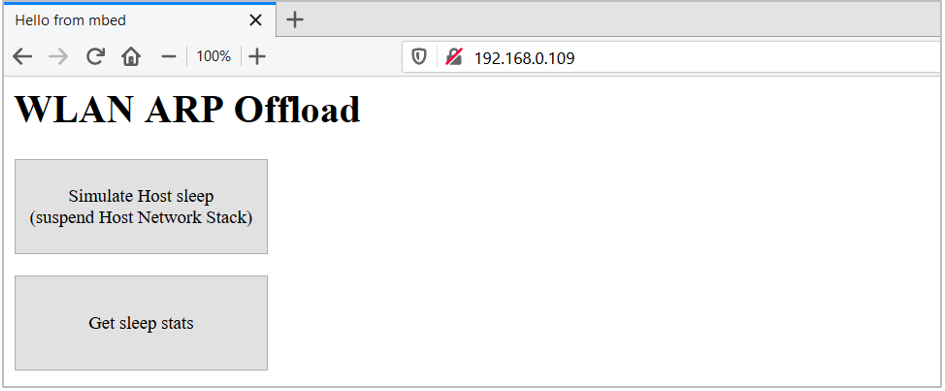

# PSoC 6 MCU: WLAN ARP Offload

This code example demonstrates the WLAN ARP (Address Resolution Protocol) Offload functionality using PSoC® 6 MCU. It employs the [Low Power Assistant](#https://github.com/cypresssemiconductorco/lpa) (LPA) middleware, which helps in developing low power applications for Cypress devices.

Tested with Mbed OS v6.2.1.

## Requirements

- Programming Language: C/C++
- Associated Parts: All [PSoC® 6 MCU](http://www.cypress.com/PSoC6) parts
- [Mbed CLI](https://github.com/ARMmbed/mbed-cli)
- [ModusToolbox v2.1](https://www.cypress.com/documentation/software-and-drivers/modustoolbox-software-archives) or later

  **Note:** You do not need to install ModusToolbox to build and run this code example. However, installing it is required when you need to:

  * Debug using the Eclipse for ModusToolbox IDE. See the [user guide](https://www.cypress.com/MTBEclipseIDEUserGuide) for details.
  * Customize the default device configuration using any of the Configurator tools
  * Port this code example to a new target that is not listed under the **Supported Kits**

## Supported Toolchains (Mbed CLI argument `--toolchain`)

- [GNU Arm Embedded Compiler v9.2.1](https://developer.arm.com/open-source/gnu-toolchain/gnu-rm/downloads) (GCC_ARM)
- [Arm compiler v6.14](https://developer.arm.com/tools-and-software/embedded/arm-compiler/downloads/version-6) (ARM)

## Supported Kits (Mbed CLI argument `--target`)

- [PSoC 6 Wi-Fi BT Prototyping Kit](https://www.cypress.com/CY8CPROTO-062-4343W) (CY8CPROTO-062-4343W)
- [PSoC 62S2 Wi-Fi BT Pioneer Kit](https://www.cypress.com/CY8CKIT-062S2-43012) (CY8CKIT-062S2-43012)
- [PSoC 6 Wi-Fi BT Pioneer Kit](https://www.cypress.com/CY8CKIT-062-WIFI-BT) (CY8CKIT-062-WIFI-BT)
- [PSoC 62S3 Wi-Fi BT Prototyping Kit](https://www.cypress.com/CY8CPROTO-062S3-4343W) (CY8CPROTO-062S3-4343W)
- [PSoC 62S1 Wi-Fi BT Pioneer Kit](https://www.cypress.com/CYW9P62S1-43438EVB-01) (CYWP62S1-43438EVB-01)
- [PSoC 62S1 Wi-Fi BT Pioneer Kit](https://www.cypress.com/CYW9P62S1-43012EVB-01) (CYWP62S1-43012EVB-01)

## Hardware Setup

This example uses the board's default configuration. See the kit user guide to ensure that the board is configured correctly.

**Note:** The PSoC 6 BLE Pioneer Kit (CY8CKIT-062-BLE) and the PSoC 6 WiFi-BT Pioneer Kit (CY8CKIT-062-WIFI-BT) ship with KitProg2 installed. The ModusToolbox software requires KitProg3. Before using this code example, make sure that the board is upgraded to KitProg3. The tool and instructions are available in the [Firmware Loader](https://github.com/cypresssemiconductorco/Firmware-loader) GitHub repository. If you do not upgrade, you will see an error like "unable to find CMSIS-DAP device" or "KitProg firmware is out of date".

For Mbed OS, the kit must be in DAPLINK mode. Refer the **KitProg3 User Guide** (found in the Documentation tab in the [Cypress Programming Solutions](https://www.cypress.com/products/psoc-programming-solutions) web page) for details of how to put the Pioneer Kit into DAPLINK mode.

## Software Setup

- Install a terminal emulator such as [Tera Term](https://ttssh2.osdn.jp/index.html.en) or [PuTTY](https://www.putty.org/) if you don't have any.

- Install the *ARP'ing* network utility:
    - [Windows OS](https://www.elifulkerson.com/projects/arp-ping.php)
    - [macOS](http://macappstore.org/arping/)
    - On Linux, use the `sudo apt install arping` command. Most of the Ubuntu OS distributions have it natively available.

This example requires the [Device Configurator Tool](https://www.cypress.com/ModusToolboxDeviceConfig), which is installed as part of [ModusToolbox v2.1](https://www.cypress.com/documentation/software-and-drivers/modustoolbox-software-archives).

## Import the Code Example using Mbed CLI Tool

Mbed CLI commands are used to import the code example and compile. See [Working with Mbed CLI web page](https://os.mbed.com/docs/mbed-os/v6.2/tools/working-with-mbed-cli.html).

```
mbed import https://github.com/cypresssemiconductorco/mbed-os-example-wlan-offload-arp
```

It first clones the code example repository from GitHub, and then deploys all the libraries. If you wish to perform the *deploy* process manually, follow the below commands:

Clone the GitHub code example repository:

```
git clone https://github.com/cypresssemiconductorco/mbed-os-example-wlan-offload-arp && cd mbed-os-example-wlan-offload-arp
```

Deploy the dependent libraries. The library files are identified with *.lib* extension.

```
mbed deploy
```

Set the current directory as *root*:

```
mbed new .
```

## Operation

1. Connect the board to your PC using the provided USB cable through the KitProg3 USB connector.

2. Open *mbed_app.json* and modify the `wifi-ssid`, `wifi-password`, and `wifi-security` macros to match the credentials of the Wi-Fi network that you want to connect to.

3. Ensure that your computer is connected to the same Wi-Fi access point that you configured in Step 2.

4. Program the board.

   ```
   mbed compile -m <TARGET> -t <TOOLCHAIN> --flash --sterm
   ```
   For instance, to build for the target CY8CPROTO_062_4343W with GCC_ARM toolchain, use the following command:

   ```
   mbed compile -m CY8CPROTO_062_4343W -t GCC_ARM --flash --sterm
   ```

   **Note:** With the --sterm option, Mbed CLI opens a new  terminal with 9600-8N1 as the setting after programming completes. Do not use this option if you want to connect using another serial terminal application such as PuTTY or Tera Term.

5. After programming, the application starts automatically. Verify that the application startup log shows the following fields:

    ```
    Info: ===================================
    Info: PSoC 6 MCU: ARP Offload Demo
    Info: ===================================
    
    Info: SSID: WIFI_SSID, Security: 4
    Info: Connecting to Wi-Fi AP: WIFI_SSID
    WLAN MAC Address : A0:C9:A0:3D:D3:6A
    WLAN Firmware    : wl0: Jan 30 2020 21:41:53 version 7.45.98.95 (r724303 CY) FWID 01-5afc8c1e
    WLAN CLM         : API: 12.2 Data: 9.10.39 Compiler: 1.29.4 ClmImport: 1.36.3 Creation: 2020-01-30 21:30:05
    WHD VERSION      : v1.91.2 : v1.91.2 : GCC 9.2 : 2020-06-25 02:15:47 -0500
    Info: MAC        : a0:c9:a0:3d:d3:6a
    Info: Netmask    : 255.255.255.0
    Info: Gateway    : 192.168.0.1
    Info: RSSI       : -50
    
    Info: IP Addr    : 192.168.0.109
    
    Info: HTTP server started successfully. Go to the webpage http://192.168.0.109
    ```

6. Open the web browser of your choice and enter the IP address `http://<ip_address>/`.  This will open the home web page for the ARP Offload application.  The IP address can be obtained from the kit's console log.

    The page has two web buttons: `Simulate Host sleep` and `Get sleep stats`.

    ##### Figure 1. ARP Offload Test: Home Page

    

7. Click `Get sleep stats` to see the sleep statistics such as *uptime*, *idle*, *sleep*, and *deep sleep* time from the Mbed OS sleep manager. The Mbed OS sleep manager determines when the system needs to go to sleep and deep sleep mode. The *Host Deepsleep* indicates the total time (in seconds) the PSoC 6 MCU was in deep sleep since the application has started.

    ##### Figure 2. ARP Offload: Host Sleep Statistics

    

8. Click `Simulate Host sleep` to suspend the host MCU network stack.

    ##### Figure 3. Suspend Network Stack 

    ##### 

    On clicking `OK`, the host network stack will be suspended and will not process any WLAN network packets. The WLAN takes care of responding to the ARP request packets from its network peers without waking the host and thus allowing the host to stay in deep sleep longer. The host will be registered with callbacks to process the Tx/Rx packets on the WLAN driver interface. In such cases, the host MCU wakes up from deep sleep and resumes the network stack if it was suspended.

9. Verify the functioning of ARP offload by sending an ARP request packet from your PC. Observe that responses are received from the WLAN device and the host MCU is not interrupted from the deep sleep.

   ```
   $ arp-ping 192.168.0.109
     Reply that A0:C9:A0:3D:D3:6A is 192.168.0.109 in 113.719ms
     Reply that A0:C9:A0:3D:D3:6A is 192.168.0.109 in 114.297ms
     Reply that A0:C9:A0:3D:D3:6A is 192.168.0.109 in 126.261ms
     Reply that A0:C9:A0:3D:D3:6A is 192.168.0.109 in 118.143ms
   ```
   To send the `arp-ping` command every 'x' seconds, use the following command:

   ```
   $ arp-ping -i X <IP address of the target kit>
   ```
   where `i` denotes the interval; ARP request packets will be sent every `X` seconds.

10. To wake up the host MCU from deep sleep, simply send a ping request from your PC.

    ```
    $ ping <IP address of the target kit>
    ```

    Optionally, you can click the web link `Wake Host` to wake up the host MCU from deep sleep. This link will be available immediately after clicking the `Simulate Host sleep` button on the home page. It redirects to the kit's home page. This will send an HTTP request (port `80`) to the target kit and that will cause the host to wake up from deep sleep because of network activity.

    ##### Figure 4. Host Wakeup
    

   **Notes**:
   - Once ARP has been offloaded to the WLAN device, the WLAN device auto replies for the ARP requests from network peers. However, it allows other packet types to reach the host MCU. Therefore, the host, if it is sleeping, will get interrupted by such packets other than ARP type from peer devices in the test network. Thus, the host may wake up irrespective of waking it through `Wake Host` web button or via `ping`command. If the test network is congested, the host is more likely to be interrupted from its sleep state. It is recommended to test the application in a less congested network or inside an RF chamber to avoid unwanted network traffic such as broadcast and multicast packets from network peers.

   - The code example disables the default device configuration provided in *mbed-os\targets\TARGET_Cypress\TARGET_PSOC6\TARGET\COMPONENT_BSP_DESIGN_MODUS* with the one provided in *COMPONENT_CUSTOM_DESIGN_MODUS\TARGET_\<kit>\\*. The custom configuration disables the Phase-locked Loop (PLL), disables the HF clock to unused peripherals like audio/USB, and configures the Buck regulator instead of the Low Dropout (LDO) regulator to power the PSoC 6 MCU device. This configuration reduces the current consumed by the PSoC 6 MCU device in active state with a small increase in deep sleep current. Enable the peripherals using the Device Configurator if you are using them.

   - This application does not try to associate with the Access Point if it is disconnected from the network. In that case, reset the kit to connect to the AP.


## Debugging

You can debug the example to step through the code. In the IDE, use the **\<Application Name> Debug (KitProg3_MiniProg4)** configuration in the **Quick Panel**. For more details, see the "Program and Debug" section in the [Eclipse IDE for ModusToolbox User Guide](https://www.cypress.com/MTBEclipseIDEUserGuide).

Follow the steps from [Eclipse IDE for ModusToolbox User Guide](https://www.cypress.com/MTBEclipseIDEUserGuide#page=23) to export the Mbed OS code example and import it into ModusToolbox IDE for programming and debugging.

Mbed OS also supports debugging using any IDE that supports GDB. We recommend the user to go through [ARM Mbed's documentation](https://os.mbed.com/docs/mbed-os/v6.2/debug-test/index.html) on the debugging steps.

**Note:** **(Only while debugging)** On the CM4 CPU, some code in `main()` may execute before the debugger halts at the beginning of `main()`. This means that some code executes twice - before the debugger stops execution, and again after the debugger resets the program counter to the beginning of `main()`. See [KBA231071](https://community.cypress.com/docs/DOC-21143) to learn about this and for the workaround.

## Design and Implementation

ARP is a protocol that employs broadcast frames to perform IP address-to-MAC address lookup from an IP address like `192.168.1.1` to a physical machine address (MAC) like `ac:32:df:14:16:07`. The ARP Offload part of the Low Power Assistant (LPA) is designed to reduce the power consumption of your connected system by reducing the time the host needs to stay awake due to ARP broadcast traffic. 

[Figure 5](#figure-5-arp-offload) shows how the ARP - Peer Auto Reply functionality is implemented.

##### Figure 5. ARP Offload
  

For more details on the feature implementation, see the [LPA Reference Manual](https://cypresssemiconductorco.github.io/lpa/lpa_api_reference_manual/html/index.html#group_lpa_p2_arp_offload).

### Why ARP Offload?
ARP broadcast traffic is normally always forwarded from the network to the WLAN device to the host network stack. If the host is sleeping, an ARP packet is a wakeup trigger. Having the WLAN device handle some of the ARP traffic will reduce the frequency of host wakeup triggers and reduce the host power consumption in sleep and deep sleep states.

This application demonstrates the **Peer Auto Reply** functionality from the ARP offload middleware. The WLAN device firmware is configured to respond to ARP requests from network peers. If the WLAN device IP address table contains the host IP address, the WLAN device will fabricate an ARP reply to an ARP request from the network ('don't bother the host'), allowing the host to stay in deep sleep. This is a power-saving feature, as the host can stay in deep sleep longer.

### Configure ARP Offload

Use the Cypress Device Configurator tool to configure WLAN ARP offload and the host MCU wake pin. By default, Mbed OS is shipped with a *design.modus* file for various Cypress kits that can be used to configure the kit's peripherals from scratch per application requirement.

The Device configurator tool is a part of Cypress' ModusToolbox IDE. Install ModusToolbox from the [ModusToolbox web page](https://www.cypress.com/products/modustoolbox-software-environment). The *design.modus* file can only be opened via the Device Configurator tool.

For this ARP Offload application demonstration, a pre-configured *design.modus* file is provided for each target *TARGET_\<kit>*. This has all the necessary settings enabled for the feature to work. We recommend that you go through the following steps. It provides additional information on how to access the *design.modus* file and configure ARP offload using the ModusToolbox Device Configurator tool.

**Note:** The steps in this section are already handled with this application. They are provided only for informational purposes.

1. Open the Device Configurator tool from the ModusToolbox installation directory: *<mtb_install_dir>\ModusToolbox\tools_2.x\device-configurator*

2. Click **File** > **Open** and open the *design.modus* file in the example directory for the respective kit, in *\<code-example-installed-dir>/COMPONENT_CUSTOM_DESIGN_MODUS/TARGET_\<kit>/design.modus*.

If the *design.modus* file does not open and the error message *No device support library path provided* appears, point to the *psoc6pdl* folder inside the *mbed-os* directory. The path should look like as follows: *mbed-os-example-wlan-offload-arp\mbed-os\targets\TARGET_Cypress\TARGET_PSOC6\psoc6pdl*. This is because the *design.modus* file will update its path to the PDL directory when it is opened for the first time.

##### Figure 6. Error Opening design.modus File


##### Figure 7. Set Path to psoc6pdl


3. Refer to the [Quick start guide](https://cypresssemiconductorco.github.io/lpa/lpa_api_reference_manual/html/index.html#group_lpa_p2_arp_offload) which highlights the ARP offload configuration. This is also available locally: *\<code-example-installed-dir\>/lpa/docs/lpa_api_reference_manual.html*.

4. On the PSoC6 MCU **Pins** tab of the Device Configurator tool, do the following:

    - **CY8CKIT_062_WIFI_BT**

        1. Enable the host WAKE pin **P2[7]** and name it *CYBSP_WIFI_HOST_WAKE*.
        2. In the **Parameters** pane, change the following:
            - **Drive Mode**: Analog High-Z. Input buffer off
            - **Initial Drive State**: High(1)
            - **Interrupt Trigger Type**: Rising Edge
        

    - **CY8CKIT_062S2_43012**
        1. Enable the host WAKE pin **P4[1]** and name it *CYBSP_WIFI_HOST_WAKE*.
        2. In the **Parameters** pane, change the following:
            - **Drive Mode**: Analog High-Z. Input buffer off
            - **Initial Drive State**: High(1)
            - **Interrupt Trigger Type**: Rising Edge
            

    - **CY8CPROTO_062_4343W**
        1. Enable the host WAKE pin **P0[4]**, and name it as *CYBSP_WIFI_HOST_WAKE*.
        2. In the **Parameters** pane, change the following:
            - **Drive Mode**: Analog High-Z. Input buffer off
            - **Initial Drive State**: High(1)
            - **Interrupt Trigger Type**: Rising Edge
        
        
        **Note:** The Wi-Fi host driver takes care of the drive mode configuration of the host WAKE pin.

5. Go to the tab for the connectivity device and configure the fields as follows. The following configuration is applicable to all [supported kits](#supported-kits).
    1. Enable Host Wake Configuration and set **Host Device Interrupt Pin** to **CYBSP_WIFI_HOST_WAKE**.
    2.  Enable ARP Offload.
    3.  Set **ARP offload Feature(s)** to **Peer Auto Reply**.
    4.  Enable **Snoop Host IP From Traffic When ARP Offload Enabled**.
    5.  Set **ARP Offload Cache Entries Expire after (s)** to **1200**.
    
    ##### Figure 8. Wi-Fi Configuration
    
    
6. Select **File** > **Save**.
   
    The generated source files *cycfg_connectivity_wifi.c* and *cycfg_connectivity_wifi.h* will be in the *GeneratedSource* folder, which is present in the same location from where you opened the *design.modus* file.


## Related Resources

| Application Notes                                            |                                                              |
| :----------------------------------------------------------- | :----------------------------------------------------------- |
| [AN227640](https://cypresssemiconductorco.github.io/cypress-mbed-os-docs/) – Getting Started with PSoC 6 and CYW43xxx in Mbed | Describes PSoC 6 MCU devices and how to build your first application with Mbed. |
| [AN227910](http://www.cypress.com/AN227910) – AN227910 - Low-Power System Design with CYW43012 and PSoC 6 MCU | Describes how to implement a low-power system design.        |
| **Code Examples**                                            |                                                              |
| [Using Mbed OS](https://github.com/cypresssemiconductorco?q=mbed-os-example%20NOT%20Deprecated) |
| [Using ModusToolbox](https://github.com/cypresssemiconductorco/Code-Examples-for-ModusToolbox-Software) | [Using PSoC Creator](https://www.cypress.com/documentation/code-examples/psoc-6-mcu-code-examples) |
| **Device Documentation**                                     |                                                              |
| [PSoC 6 MCU Datasheets](https://www.cypress.com/search/all?f[0]=meta_type%3Atechnical_documents&f[1]=resource_meta_type%3A575&f[2]=field_related_products%3A114026) | [PSoC 6 Technical Reference Manuals](https://www.cypress.com/search/all/PSoC%206%20Technical%20Reference%20Manual?f[0]=meta_type%3Atechnical_documents&f[1]=resource_meta_type%3A583) |
| **Development Kits**                                         | Buy at www.cypress.com                                       |
| [CY8CKIT-062S2-43012 PSoC 62S2 WiFi-BT Pioneer Kit](http://www.cypress.com/CY8CKIT-062S2-43012) | [CY8CKIT-062-WiFi-BT PSoC 6   WiFi-BT Pioneer Kit](http://www.cypress.com/CY8CKIT-062-WiFi-BT) |
| [CY8CPROTO-062-4343W   PSoC 6 Wi-Fi BT Prototyping Kit](http://www.cypress.com/CY8CPROTO-062-4343w) | [CY8CPROTO-062S3-4343W PSoC 6   WiFi-BT Pioneer Kit](http://www.cypress.com/CY8CPROTO-062S3-4343W) |
| [CYW9P62S1-43438EVB-01](https://www.cypress.com/CYW9P62S1-43438EVB-01) PSoC 62S1 Wi-Fi BT Pioneer Kit | [CYW9P62S1-43012EVB-01](https://www.cypress.com/CYW9P62S1-43012EVB-01) PSoC 62S1 Wi-Fi BT Pioneer Kit |                                                             |
| **Libraries**                                                 |                                                              |
| PSoC 6 Peripheral Driver Library (PDL) and docs  | [psoc6pdl](https://github.com/cypresssemiconductorco/psoc6pdl) on GitHub |
| Cypress Hardware Abstraction Layer (HAL) Library and docs     | [psoc6hal](https://github.com/cypresssemiconductorco/psoc6hal) on GitHub |
| **Middleware**                                               |                                                              |
| Low Power Assistant (LPA)                    | [lpa](https://github.com/cypresssemiconductorco/lpa) on GitHub |
| HTTP Server                                    | [http-server](https://github.com/cypresssemiconductorco/http-server) on GitHub |
| Connectivity-Utilities                                    | [connectivity-utilities](https://github.com/cypresssemiconductorco/connectivity-utilities) on GitHub |
| Links to all PSoC 6 MCU Middleware                               | [psoc6-middleware](https://github.com/cypresssemiconductorco/psoc6-middleware) on GitHub |
| **Tools**                                                    |                                                              |
| [Eclipse IDE for ModusToolbox](https://www.cypress.com/modustoolbox)     | The cross-platform, Eclipse-based IDE for IoT designers that supports application configuration and development targeting converged MCU and wireless systems.             |
| [PSoC Creator™](https://www.cypress.com/products/psoc-creator-integrated-design-environment-ide) | The Cypress IDE for PSoC and FM0+ MCU development.            |

## Other Resources

Cypress provides a wealth of data at www.cypress.com to help you select the right device, and quickly and effectively integrate it into your design.

For PSoC 6 MCU devices, see [How to Design with PSoC 6 MCU - KBA223067](https://community.cypress.com/docs/DOC-14644) in the Cypress community.

## Document History

Document Title: *CE229165* - *PSoC 6 MCU: WLAN ARP Offload*

| Revision | Description of Change                                        |
| -------- | ------------------------------------------------------------ |
| 1.0.0    | Initial release.<br/>Tested with Mbed OS v5.14.2 and LPA middleware v1.0.0 |
| 1.1.0    | Readme updates<br/>Modified folder structure                 |
| 2.0.0    | Updated to Mbed OS v6.2.1 and LPA middleware v3.0.0            |

------


All other trademarks or registered trademarks referenced herein are the property of their respective owners.


-------------------------------------------------------------------------------

© Cypress Semiconductor Corporation, 2020. This document is the property of Cypress Semiconductor Corporation and its subsidiaries ("Cypress"). This document, including any software or firmware included or referenced in this document ("Software"), is owned by Cypress under the intellectual property laws and treaties of the United States and other countries worldwide. Cypress reserves all rights under such laws and treaties and does not, except as specifically stated in this paragraph, grant any license under its patents, copyrights, trademarks, or other intellectual property rights. If the Software is not accompanied by a license agreement and you do not otherwise have a written agreement with Cypress governing the use of the Software, then Cypress hereby grants you a personal, non-exclusive, nontransferable license (without the right to sublicense) (1) under its copyright rights in the Software (a) for Software provided in source code form, to modify and reproduce the Software solely for use with Cypress hardware products, only internally within your organization, and (b) to distribute the Software in binary code form externally to end users (either directly or indirectly through resellers and distributors), solely for use on Cypress hardware product units, and (2) under those claims of Cypress's patents that are infringed by the Software (as provided by Cypress, unmodified) to make, use, distribute, and import the Software solely for use with Cypress hardware products. Any other use, reproduction, modification, translation, or compilation of the Software is prohibited.  
TO THE EXTENT PERMITTED BY APPLICABLE LAW, CYPRESS MAKES NO WARRANTY OF ANY KIND, EXPRESS OR IMPLIED, WITH REGARD TO THIS DOCUMENT OR ANY SOFTWARE OR ACCOMPANYING HARDWARE, INCLUDING, BUT NOT LIMITED TO, THE IMPLIED WARRANTIES OF MERCHANTABILITY AND FITNESS FOR A PARTICULAR PURPOSE. No computing device can be absolutely secure. Therefore, despite security measures implemented in Cypress hardware or software products, Cypress shall have no liability arising out of any security breach, such as unauthorized access to or use of a Cypress product. CYPRESS DOES NOT REPRESENT, WARRANT, OR GUARANTEE THAT CYPRESS PRODUCTS, OR SYSTEMS CREATED USING CYPRESS PRODUCTS, WILL BE FREE FROM CORRUPTION, ATTACK, VIRUSES, INTERFERENCE, HACKING, DATA LOSS OR THEFT, OR OTHER SECURITY INTRUSION (collectively, "Security Breach"). Cypress disclaims any liability relating to any Security Breach, and you shall and hereby do release Cypress from any claim, damage, or other liability arising from any Security Breach. In addition, the products described in these materials may contain design defects or errors known as errata which may cause the product to deviate from published specifications. To the extent permitted by applicable law, Cypress reserves the right to make changes to this document without further notice. Cypress does not assume any liability arising out of the application or use of any product or circuit described in this document. Any information provided in this document, including any sample design information or programming code, is provided only for reference purposes. It is the responsibility of the user of this document to properly design, program, and test the functionality and safety of any application made of this information and any resulting product. "High-Risk Device" means any device or system whose failure could cause personal injury, death, or property damage. Examples of High-Risk Devices are weapons, nuclear installations, surgical implants, and other medical devices. "Critical Component" means any component of a High-Risk Device whose failure to perform can be reasonably expected to cause, directly or indirectly, the failure of the High-Risk Device, or to affect its safety or effectiveness. Cypress is not liable, in whole or in part, and you shall and hereby do release Cypress from any claim, damage, or other liability arising from any use of a Cypress product as a Critical Component in a High-Risk Device. You shall indemnify and hold Cypress, its directors, officers, employees, agents, affiliates, distributors, and assigns harmless from and against all claims, costs, damages, and expenses, arising out of any claim, including claims for product liability, personal injury or death, or property damage arising from any use of a Cypress product as a Critical Component in a High-Risk Device. Cypress products are not intended or authorized for use as a Critical Component in any High-Risk Device except to the limited extent that (i) Cypress's published data sheet for the product explicitly states Cypress has qualified the product for use in a specific High-Risk Device, or (ii) Cypress has given you advance written authorization to use the product as a Critical Component in the specific High-Risk Device and you have signed a separate indemnification agreement.  
Cypress, the Cypress logo, Spansion, the Spansion logo, and combinations thereof, WICED, PSoC, CapSense, EZ-USB, F-RAM, and Traveo are trademarks or registered trademarks of Cypress in the United States and other countries. For a more complete list of Cypress trademarks, visit cypress.com. Other names and brands may be claimed as property of their respective owners.
