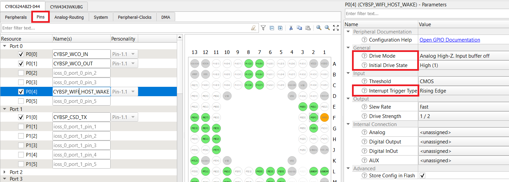
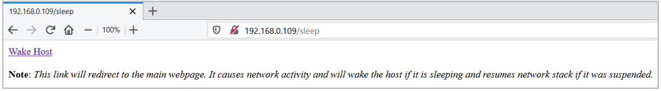

# ARP (Address Resolution Protocol) Offload

 This code example demonstrates the ARP Offload functionality offered by the Cypress WLAN device while the PSoC® 6 MCU is in sleep/deep sleep.

## Requirements

- [Mbed CLI](https://github.com/ARMmbed/mbed-cli)
- Device Configurator - installed as part of [ModusToolbox™ IDE](https://www.cypress.com/products/modustoolbox-software-environment) v2.0
- [ARPing Network Tool](https://www.elifulkerson.com/projects/arp-ping.php) for Windows OS
- Programming Language: C++
- Associated Parts: All [PSoC® 6 MCU](http://www.cypress.com/PSoC6) parts

## Supported Kits

- CY8CPROTO-062-4343W [PSoC 6 Wi-Fi BT Prototyping Kit](https://www.cypress.com/CY8CPROTO-062-4343W) (CY8CPROTO_062_4343W)
- CY8CKIT-062-WiFi-BT [PSoC 6 WiFi-BT Pioneer Kit](https://www.cypress.com/CY8CKIT-062-WiFi-BT) (CY8CKIT_062_WIFI_BT)
- CY8CKIT-062S2-43012 [PSoC 62S2 Wi-Fi BT Pioneer Kit](https://www.cypress.com/CY8CKIT-062S2-43012) (CY8CKIT_062S2_43012)

## Hardware Setup

This example uses the kit’s default configuration. See the kit guide to ensure that the kit is configured correctly.

**Note**: The PSoC 6 BLE Pioneer kit and the PSoC 6 WiFi-BT Pioneer kit ship with KitProg2 installed. Before using this code example, make sure that the kit is upgraded to KitProg3. The tool and instructions are available in the [Firmware Loader](https://github.com/cypresssemiconductorco/Firmware-loader) GitHub repository. If you do not upgrade, you will see an error like “unable to find CMSIS-DAP device” or “KitProg firmware is out of date”.

## Software Setup

Install a terminal emulator such as [Tera Term](https://ttssh2.osdn.jp/index.html.en) or [PuTTY](https://www.putty.org/) if you don't have any.

This example requires [Device Configurator Tool](https://www.cypress.com/ModusToolboxDeviceConfig), which is installed as part of [ModusToolbox™ IDE](https://www.cypress.com/products/modustoolbox-software-environment) v2.0. Refer to the [ModusToolbox Installation Guide](http://www.cypress.com/ModusToolboxInstallGuide) for installation instructions.

## Using the Code Example in Mbed CLI Tools
Mbed CLI commands are used to import the code example and compile. See [Working with Mbed CLI web page](https://os.mbed.com/docs/mbed-os/v5.14/tools/working-with-mbed-cli.html).

1. Import the code example into your Mbed OS directory using the following command:
    ```
    mbed import https://github.com/cypresssemiconductorco/mbed-os-example-wlan-offload-arp
    ```
 
2. Change working directory to the code example folder.
    ```
    cd mbed-os-example-wlan-offload-arp
    ```
3. Open *mbed_app.json* and edit the Wi-Fi SSID and password to match your AP settings.

4. Connect the board to your PC using the provided USB cable through the USB connector.

5. To allow programming from Mbed CLI, the kit must be in DAPLink mode. See [Firmware-loader](https://github.com/cypresssemiconductorco/Firmware-loader) for more information on how to update the firmware and switch to DAPLink mode.

6. Compile the code and program the target board.
    ```
    mbed compile -m \<TARGET\> -t \<TOOLCHAIN\> --flash --sterm
    ```
    For example, to build for the target CY8CKIT_062S2_43012 with GCC_ARM toolchain, use the following command:
    ```
    mbed compile -m CY8CKIT_062S2_43012 -t GCC_ARM --flash --sterm
    ```
**Note:** The *--sterm* option opens the serial terminal with 9600-8N1 setting on the command prompt itself after programming completes. Do not use this option if you wish to connect using another serial terminal application.

## Operation
1. After programming, the application starts automatically. Verify that the application startup log shows the following fields:

    ```
    SSID: <SSID_NAME>, Security: 4

    Connecting to <SSID_NAME>...
    WLAN MAC Address : <WLAN MAC ADDR>
    WLAN Firmware    : wl0: <WLAN INFO>
    WLAN CLM         : API: <CLM INFO>
    WHD VERSION      : <WHD VERSION INFO>
    MAC     : <WLAN MAC ADDR>
    Netmask : 255.255.255.0
    Gateway : 192.168.43.116
    RSSI    : -60

    IP Addr : 192.168.43.37

    HTTP server started successfully. Go to the webpage http://192.168.43.37
    ```
2. The HTTP web page can be accessed through the URL `http://192.168.43.37` as printed on the serial terminal.

3. To get quickly started with the demo, jump to the [Verify ARP Offload](#verify-arp-offload) section.

## Design and Implementation
ARP is a protocol that employs broadcast frames to perform IP address-to-MAC address lookup from an IP address like 192.168.1.1 to a physical machine address (MAC) like ac:32:df:14:16:07. The ARP Offload part of the Low Power Assistant (LPA) is designed to reduce the power consumption of your connected system by reducing the time the host needs to stay awake due to ARP broadcast traffic. 

[Figure 1](#figure-1-arp-offload) shows how the ARP - Peer Auto Reply functionality is implemented.
##### Figure 1. ARP Offload


For more details on the feature implementation, see the [LPA Reference Manual](https://cypresssemiconductorco.github.io/lpa/lpa_api_reference_manual/html/index.html#group_lpa_p2_arp_offload).

### Why ARP Offload?
ARP broadcast traffic is normally always forwarded from the network to the WLAN device to the host network stack, which, if the host is sleeping, is a wakeup trigger. Having the device handle some of the ARP traffic will reduce the frequency of host wakeup triggers and reduce the host power consumption in sleep and deep sleep states.

This application demonstrates the **Peer Auto Reply** functionality from the ARP offload middleware. The WLAN device firmware is configured to respond to the ARP requests from network peers. If the WLAN device host IP address table contains the Host IP address, the WLAN device will fabricate an ARP reply to an ARP request from the network (don't bother the host), allowing the host to stay in deep sleep. This is a power-saving feature, as the host can stay in deep sleep longer.

### Configure ARP Offload

Use the Cypress Device Configurator tool to configure WLAN ARP offload and the host MCU wake pin. By default, Mbed OS is shipped with a *design.modus* file for various Cypress kits that can be used to configure the kit's peripherals from scratch per application requirement.

The Device Configurator tool is a part of Cypress' ModusToolBox (MTB) IDE. Install ModusToolbox from the [ModusToolbox web page](https://www.cypress.com/products/modustoolbox-software-environment). The *design.modus* file can only be opened via the Device Configurator tool.

For this ARP Offload application demonstration, a pre-configured *design.modus* file is provided for each target *TARGET_\<kit>*. This has all the necessary settings enabled for the feature to work. We recommend the user to also go through the below steps. It provides additional information on how to access the design.modus and how to configure the ARP offload using ModusToolbox Device Configurator tool.

**Note:** The steps in this section are already handled with this application. They are provided only for informational purposes.

1. Open Device Configurator tool from the ModusToolbox installation directory: *<mtb_install_dir>\ModusToolbox\tools_2.0\device-configurator*

2. Click File -> Open and open *design.modus* file which is available in this example directory for the respective kit, in *\<code-example-installed-dir>/TARGET_\<kit>/CUSTOM_BSP_DESIGN_MODUS/design.modus*. 

If the *design.modus* file does not open and pops with a error message *No device support library path provided*, then point to the *psoc6pdl* folder inside the *mbed-os* directory. The path should look like as follows: *mbed-os-example-wlan-offload-arp\mbed-os\targets\TARGET_Cypress\TARGET_PSOC6\psoc6pdl*. This is because the *design.modus* file will update its path to the PDL directory when it is opened for the first time.

##### Figure 2. Error Opening design.modus File


##### Figure 3. Set Path to psoc6pdl


3. Refer to the [Quick start guide](https://cypresssemiconductorco.github.io/lpa/lpa_api_reference_manual/html/index.html#group_lpa_p2_arp_offload) which highlights the ARP offload configuration. This is also available locally: *\<code-example-installed-dir\>/lpa/docs/lpa_api_reference_manual.html*.

4. On the **PSoC6 MCU Pins** tab of the Device Configurator tool, do the following:

    - **CY8CKIT_062_WIFI_BT**
        - Enable the Host wake pin *P2[7]* and name it *CYBSP_WIFI_HOST_WAKE*.
        - In the **Parameters** pane, change the following.
            - *Drive Mode*: Analog High-Z. Input buffer off.
            - *Initial Drive State*: High(1).
            - *Interrupt Trigger Type*: Rising Edge.
        

    - **CY8CKIT_062S2_43012**
        - Enable the Host wake pin *P4[1]* and name it *CYBSP_WIFI_HOST_WAKE*.
        - In the **Parameters** pane, change the following.
            - *Drive Mode*: Analog High-Z. Input buffer off.
            - *Initial Drive State*: High(1).
            - *Interrupt Trigger Type*: Rising Edge.
        

    - **CY8CPROTO_062_4343W**
        - Enable the Host wake pin *P0[4]* and name it *CYBSP_WIFI_HOST_WAKE*.
        - In the **Parameters** pane, change the following.
            - *Drive Mode*: Analog High-Z. Input buffer off.
            - *Initial Drive State*: High(1).
            - *Interrupt Trigger Type*: Rising Edge.
        

5. Go to **WiFi** tab and configure the fields as given below. The below configuration is applicable to all the [supported kits](#supported-kits) in this document. [Figure 4](#figure-4-wifi-configuration) and [Figure 5](#figure-5-arp-offload-configuration) shows reference to ARP Offload configuration for the CY8CKIT_062S2_43012 kit.
    - Enable Host Wake Configuration and set **Host Device Interrupt Pin** to **CYBSP_WIFI_HOST_WAKE**.
    - Enable ARP Offload.
    - Set **ARP offload Feature(s)** to **Peer Auto Reply**.
    - Enable **Snoop Host IP From Traffic When ARP Offload Enabled**.
    - Set **ARP Offload Cache Entries Expire after (s)** to **1200**.
      
    ##### Figure 4. WiFi Configuration
    
    
    ##### Figure 5. ARP Offload Configuration
    

6. Click **File > Save**. The generated sources for Wi-Fi application named *cycfg_connectivity_wifi.c* and *cycfg_connectivity_wifi.h*
    are generated under the *GeneratedSource* folder in the same location where the **design.modus** file was opened.

For more information on low-power system design, see [AN227910](http://www.cypress.com/AN227910).


## Verify ARP Offload

 By default, the application is configured with **ARP Peer Auto Reply with Host snooping**. This means that the host doesn't need to wake up for ARP requests from peer devices.

Do the following to verify the ARP offload feature:

1. Open web browser and enter the IP address `(http://<ip_address>/)`.    

    This will open the home page for the ARP Offload application. The home page has two web buttons: *Simulate Host Sleep* and *Get Sleep Stats*.

2. Click on **Get Sleep Stats** to see the Mbed OS sleep statistics such as uptime, idle, sleep, and deep sleep time. The Mbed OS sleep manager determines when the system need to go to sleep and deep sleep mode.
   
   ##### Figure 6. ARP Offload Test: Home Page
    

   ##### Figure 7. ARP Offload: Host Sleep Statistics
    

3. Click on **Simulate Host Sleep** to suspend the network stack.
    
   ##### Figure 8. Suspend Network Stack
    
    
    This helps the Host MCU to enter deep sleep because Mbed OS will not be processing any network packets. The host MCU will be registered with callbacks on TX/RX activity on EMAC. Such activity will cause the network stack to resume if it was suspended.
    
    The concept of ARP Offload is that when a peer device sends an ARP request packet, the host MCU can remain in deep sleep and does not have to wake up to service the peer request. The WLAN device will take care of responding to the peer ARP request packets. 
    
    You can try Linux commands to test ARP'ing the kit and check whether the host wakes up from deep sleep. The `arping` utility is natively available on Ubuntu OS.
    ```
    Syntax:
    > arping -b -c <No of ARP requests> -I <Wi-Fi Interface> <Target IP address>

    Example:
    > arping -b -c 1 -I wlan0 192.168.43.37
    This will send one ARP request packet from wlan0 interface to the target device ip address 192.168.43.37.
    ```

4. In order to wake up the host MCU, simply send a ping packet from another device connected to the same Wi-Fi network as the kit connected to.

   ```
   > ping <Target IP Address>
   ``` 
    Optionally, you can just click the web link **wake host** to wake up the host. This link will be available immediately after clicking the *Simulate Host Sleep* button on the home page. It redirects to the kit's home page. This activity performs an HTTP request that will cause the host to wake up.

    ##### Figure 9. Host Wakeup
    
    
**Note**:
- Once ARP has been offloaded to the WLAN device, it auto replies for the ARP requests from peers but it can allow other network packet types to reach the host for its service. So the host if it is sleeping, has more chance of getting interrupted by network packets other than ARP from peer devices in a network. So there is no surprise if the Host wakes up irrespective of waking it through *wake_host* web button or via *ping* command. If the network is more congested, the host gets more probability of getting interrupted from its sleep state. It is recommended to test the application in less congested network or inside a RF chamber to avoid unwanted network traffic from peers.

- The code example disables the default device configuration provided in `mbed-os\targets\TARGET_Cypress\TARGET_PSOC6\TARGET\COMPONENT_BSP_DESIGN_MODUS` with the one provided in `TARGET/CUSTOM_BSP_DESIGN_MODUS`. The custom configuration disables the Phase-locked Loop (PLL), disables HF clock to unused peripherals like audio/USB, and configures the Buck instead of Low Dropout (LDO) regulator to power the PSoC 6 device. This configuration reduces the current consumed by the PSoC 6 in Active state with a small increase in Deep Sleep current. Please enable the peripherals using `device-configurator` if you are using them. The `device-configurator` is bundled with the ModusToobox 2.0 installation and can be found at *\<ModusToolbox_installed_location>/tools_\*.\*/device-configurator*.

- This application does not try to associate to Access Point if disconnected from the network. In that case, reset the kit to connect to AP.


## Reference Documents

|                  Application Notes                           |                        Description                           |
| :----------------------------------------------------------- | :----------------------------------------------------------- |
| [AN227640](https://cypresssemiconductorco.github.io/cypress-mbed-os-docs/) – Getting Started with PSoC 6 and CYW43xxx in Mbed | Describes PSoC 6 MCU devices and how to build your first application with Mbed. |
| [AN227910](http://www.cypress.com/AN227910) – Low-Power System Design with PSoC 6 and 43012 | Describes how to implement a low-power system design.        |
| **Code Examples**                                            |                                                              |
| [Using Mbed OS](https://github.com/cypresssemiconductorco?q=mbed-os-example%20NOT%20Deprecated) |
| [Using ModusToolbox IDE](https://github.com/cypresssemiconductorco/Code-Examples-for-ModusToolbox-Software) | [Using PSoC Creator](https://www.cypress.com/documentation/code-examples/psoc-6-mcu-code-examples) |
| **Device Documentation**                                     |                                                              |
| [PSoC 6 MCU Datasheets](http://www.cypress.com/search/all?f[0]=meta_type%3Atechnical_documents&f[1]=resource_meta_type%3A575&f[2]=field_related_products%3A114026) | [PSoC 6 Technical Reference Manuals](https://www.cypress.com/search/all/PSoC%206%20Technical%20Reference%20Manual?f[0]=meta_type%3Atechnical_documents&f[1]=resource_meta_type%3A583) |
| **Development Kits**                                         | Buy at Cypress.com                                     |
| [CY8CKIT-062S2-43012 PSoC 62S2 WiFi-BT Pioneer Kit](http://www.cypress.com/CY8CKIT-062-BLE) | [CY8CKIT-062-WiFi-BT PSoC 6   WiFi-BT Pioneer Kit](http://www.cypress.com/CY8CKIT-062-WiFi-BT) |
| [CY8CPROTO-062-4343W   PSoC 6 Wi-Fi BT Prototyping Kit](http://www.cypress.com/cy8cproto-062-4343w) |                                                              |
| **Libraries**                                                |                                                              |
| PSoC 6 Peripheral Driver Library and docs                    | [psoc6pdl](https://github.com/cypresssemiconductorco/psoc6pdl) on GitHub |
| Cypress Hardware Abstraction Layer Library and docs          | [psoc6hal](https://github.com/cypresssemiconductorco/psoc6hal) on GitHub |
| **Middleware**                                               | Middleware libraries are distributed on GitHub               |
| Low Power Assistant (LPA)                    | [lpa](https://github.com/cypresssemiconductorco/lpa) on GitHub |
| HTTP Server                                    | [http-server](https://github.com/cypresssemiconductorco/http-server) on GitHub |
| Connectivity-Utilities                                    | [connectivity-utilities](https://github.com/cypresssemiconductorco/connectivity-utilities) on GitHub |
| Links to all PSoC 6 MCU Middleware                               | [psoc6-middleware](https://github.com/cypresssemiconductorco/psoc6-middleware) on GitHub |
| **Tools**                                                    |                                                              |
| [ModusToolbox   IDE](http://www.cypress.com/modustoolbox)    | The Cypress IDE for PSoC 6 and IoT designers                 |
| [PSoC Creator](https://www.cypress.com/products/psoc-creator-integrated-design-environment-ide) | The Cypress IDE for PSoC and FM0+ development                |

Cypress provides a wealth of data at www.cypress.com to help you to select the right device, and quickly and effectively integrate the device into your design.

For PSoC 6 MCU devices, see [How to Design with PSoC 6 MCU - KBA223067](https://community.cypress.com/docs/DOC-14644) in the Cypress community.

## LPA Related Documents
 - [LPA Middleware RELEASE.md](https://github.com/cypresssemiconductorco/lpa/blob/master/README.md)
 - [LPA Middleware API Reference Guide](https://cypresssemiconductorco.github.io/lpa/lpa_api_reference_manual/html/index.html)
 - [ModusToolbox Software Environment, Quick Start Guide, Documentation, and Videos](https://www.cypress.com/products/modustoolbox-software-environment)
 - [LPA Middleware Code Example for MBED OS](https://github.com/cypresssemiconductorco)
 - [ModusToolbox Device Configurator Tool Guide](https://www.cypress.com/file/455241/download)

## Document History

Document Title: CE229165 - Mbed OS and PSoC 6 MCU: WLAN ARP Offload

| Revision |               Description of Change               |
| -------- |-------------------------------------------------- |
|   1.0.0  |  Initial release.<br/>Tested with Mbed OS v5.14.2 and LPA middleware v1.0.0    |

------


All other trademarks or registered trademarks referenced herein are the property of their respective owners.


-------------------------------------------------------------------------------

© Cypress Semiconductor Corporation, 2019. This document is the property of Cypress Semiconductor Corporation and its subsidiaries ("Cypress"). This document, including any software or firmware included or referenced in this document ("Software"), is owned by Cypress under the intellectual property laws and treaties of the United States and other countries worldwide. Cypress reserves all rights under such laws and treaties and does not, except as specifically stated in this paragraph, grant any license under its patents, copyrights, trademarks, or other intellectual property rights. If the Software is not accompanied by a license agreement and you do not otherwise have a written agreement with Cypress governing the use of the Software, then Cypress hereby grants you a personal, non-exclusive, nontransferable license (without the right to sublicense) (1) under its copyright rights in the Software (a) for Software provided in source code form, to modify and reproduce the Software solely for use with Cypress hardware products, only internally within your organization, and (b) to distribute the Software in binary code form externally to end users (either directly or indirectly through resellers and distributors), solely for use on Cypress hardware product units, and (2) under those claims of Cypress's patents that are infringed by the Software (as provided by Cypress, unmodified) to make, use, distribute, and import the Software solely for use with Cypress hardware products. Any other use, reproduction, modification, translation, or compilation of the Software is prohibited.  
TO THE EXTENT PERMITTED BY APPLICABLE LAW, CYPRESS MAKES NO WARRANTY OF ANY KIND, EXPRESS OR IMPLIED, WITH REGARD TO THIS DOCUMENT OR ANY SOFTWARE OR ACCOMPANYING HARDWARE, INCLUDING, BUT NOT LIMITED TO, THE IMPLIED WARRANTIES OF MERCHANTABILITY AND FITNESS FOR A PARTICULAR PURPOSE. No computing device can be absolutely secure. Therefore, despite security measures implemented in Cypress hardware or software products, Cypress shall have no liability arising out of any security breach, such as unauthorized access to or use of a Cypress product. CYPRESS DOES NOT REPRESENT, WARRANT, OR GUARANTEE THAT CYPRESS PRODUCTS, OR SYSTEMS CREATED USING CYPRESS PRODUCTS, WILL BE FREE FROM CORRUPTION, ATTACK, VIRUSES, INTERFERENCE, HACKING, DATA LOSS OR THEFT, OR OTHER SECURITY INTRUSION (collectively, "Security Breach"). Cypress disclaims any liability relating to any Security Breach, and you shall and hereby do release Cypress from any claim, damage, or other liability arising from any Security Breach. In addition, the products described in these materials may contain design defects or errors known as errata which may cause the product to deviate from published specifications. To the extent permitted by applicable law, Cypress reserves the right to make changes to this document without further notice. Cypress does not assume any liability arising out of the application or use of any product or circuit described in this document. Any information provided in this document, including any sample design information or programming code, is provided only for reference purposes. It is the responsibility of the user of this document to properly design, program, and test the functionality and safety of any application made of this information and any resulting product. "High-Risk Device" means any device or system whose failure could cause personal injury, death, or property damage. Examples of High-Risk Devices are weapons, nuclear installations, surgical implants, and other medical devices. "Critical Component" means any component of a High-Risk Device whose failure to perform can be reasonably expected to cause, directly or indirectly, the failure of the High-Risk Device, or to affect its safety or effectiveness. Cypress is not liable, in whole or in part, and you shall and hereby do release Cypress from any claim, damage, or other liability arising from any use of a Cypress product as a Critical Component in a High-Risk Device. You shall indemnify and hold Cypress, its directors, officers, employees, agents, affiliates, distributors, and assigns harmless from and against all claims, costs, damages, and expenses, arising out of any claim, including claims for product liability, personal injury or death, or property damage arising from any use of a Cypress product as a Critical Component in a High-Risk Device. Cypress products are not intended or authorized for use as a Critical Component in any High-Risk Device except to the limited extent that (i) Cypress's published data sheet for the product explicitly states Cypress has qualified the product for use in a specific High-Risk Device, or (ii) Cypress has given you advance written authorization to use the product as a Critical Component in the specific High-Risk Device and you have signed a separate indemnification agreement.  
Cypress, the Cypress logo, Spansion, the Spansion logo, and combinations thereof, WICED, PSoC, CapSense, EZ-USB, F-RAM, and Traveo are trademarks or registered trademarks of Cypress in the United States and other countries. For a more complete list of Cypress trademarks, visit cypress.com. Other names and brands may be claimed as property of their respective owners.


